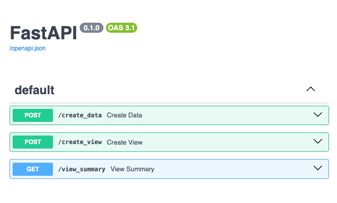
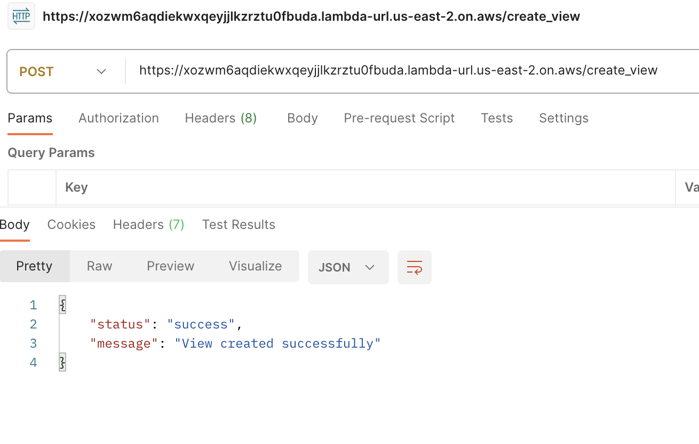
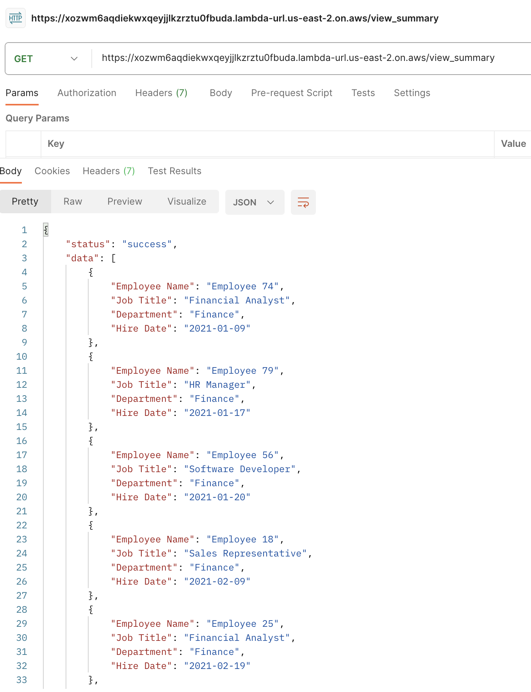

# Empleados en TI
## Descripción

Este proyecto implementa una solución backend completa utilizando AWS CDK para desplegar una aplicación FastAPI con una base de datos MySQL en RDS. La aplicación permite la creación y visualización de datos de empleados, departamentos y títulos laborales. La documentación de la API, generada mediante Swagger, se puede acceder a través de una Function URL de AWS Lambda.

# Características
- **FastAPI** para una aplicación backend rápida y eficiente con generación automática de documentación Swagger.
- **AWS CDK** para la infraestructura como código, facilitando el despliegue reproducible en AWS.
- **AWS RDS** para almacenar datos relacionales de manera segura y escalable.
- **AWS Lambda** para ejecutar la aplicación FastAPI sin servidores, reduciendo costos y simplificando la operación.
- **Function URL** para acceder directamente a la API y su documentación sin necesidad de un API Gateway.
# Requisitos Previos
Asegúrate de tener las siguientes herramientas instaladas y configuradas:

- AWS CLI versión 2
- Node.js versión 20.x o superior
- Python versión 3.9 o superior
- Docker (opcional, para despliegues utilizando contenedores)
# Instalación y Configuración
## Configuración de AWS CLI
Asegúrate de que tu AWS CLI esté configurado con las credenciales y la región adecuadas:
```bash
    aws configure
```
## Instalación de Dependencias
Instala las dependencias de Node.js y Python necesarias para el proyecto:

```bash
# Instalar dependencias de CDK
npm install


# Instalar dependencias de Python
pip install -r requirements.txt
```
# Despliegue
## Utilizando AWS CDK
Para desplegar la infraestructura y la aplicación:

```bash
cdk bootstrap
cdk deploy
```

## Utilizando Docker (Opcional)
Construye y despliega usando Docker:

```bash
docker build -t cdk-deployment .
docker run --rm -it \
  -e AWS_ACCESS_KEY_ID=<tu-access-key-id> \
  -e AWS_SECRET_ACCESS_KEY=<tu-secret-access-key> \
  -e AWS_DEFAULT_REGION=<tu-region> \
  cdk-deployment
```
# Uso
Una vez desplegado, puedes interactuar con la aplicación de las siguientes maneras:

## Crear Datos de Ejemplo
```bash
curl -X POST <function-url>/create_data
```
## Crear Vista de Resumen
```bash
curl -X POST <function-url>/create_view
```
## Acceder a la Vista de Resumen
```bash
curl <function-url>/view_summary
```

# Documentación de la API (Swagger UI)
Accede a **<function-url>/docs** para ver la documentación interactiva de la API generada por Swagger.


# Licencia
Este proyecto está licenciado bajo la Licencia MIT - ver el archivo LICENSE para más detalles.

# ScreenShots
## Swager Frontend to the API

## Request in Postman For Create View

## Request in Postman For Get The data for the View Summary

